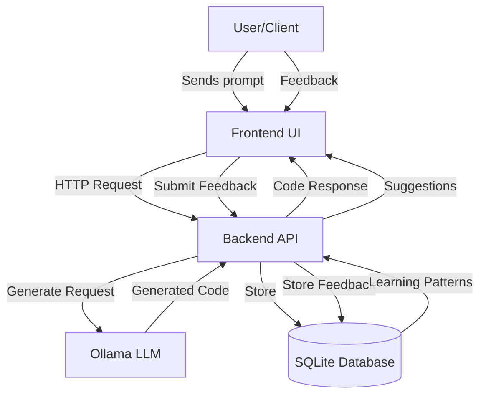
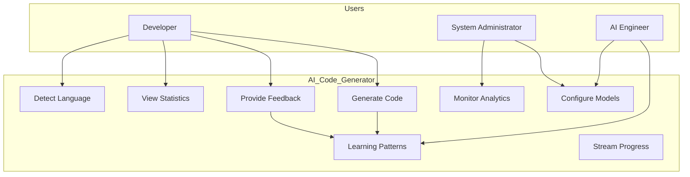
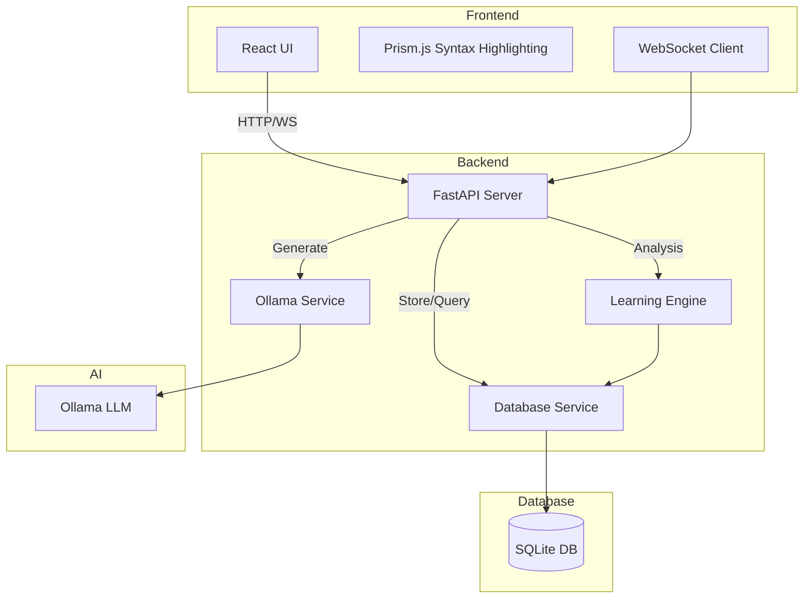
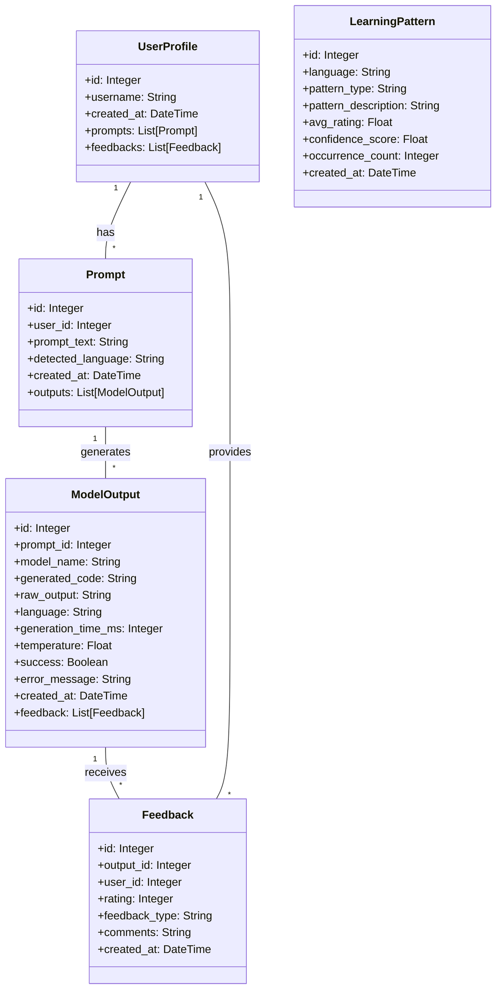
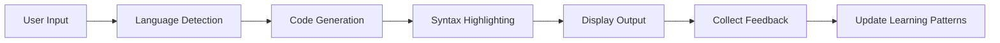
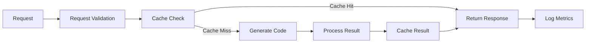
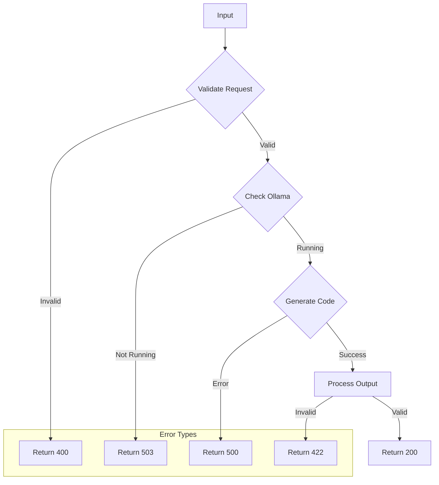
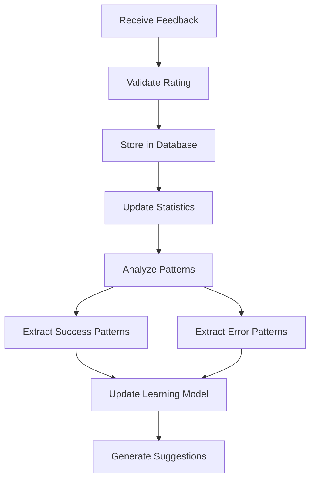

# System Diagrams for AI Code Generator

## 1. Data Flow Diagram

## 2. Use Case Diagram

## 3. System Architecture Block Diagram

## 4. Class Diagram

## 5. Main Pipeline

## 6. Performance Pipeline

## 7. Error Handling Pipeline

## 8. Learning Feedback Pipeline
